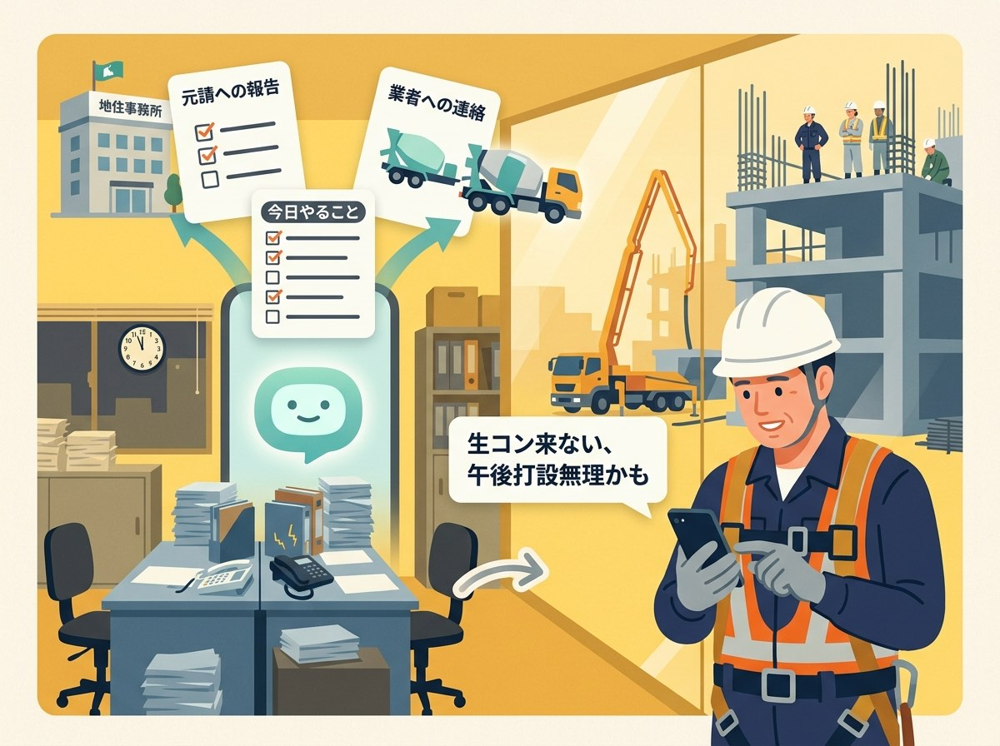
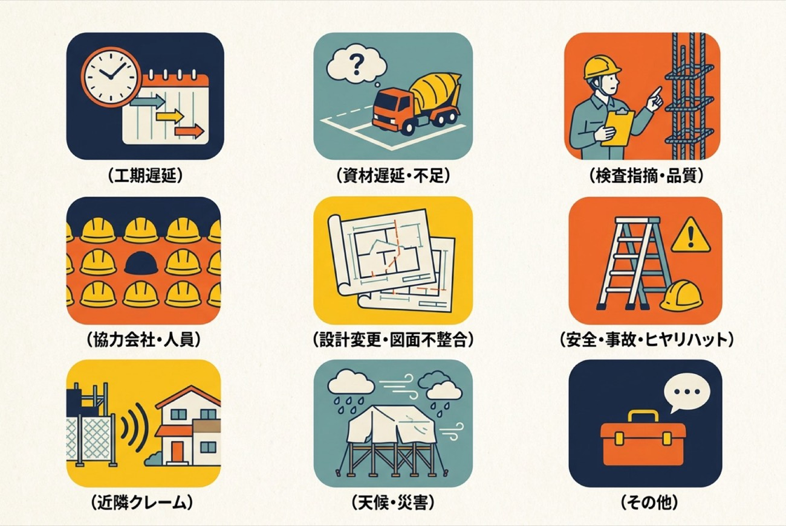
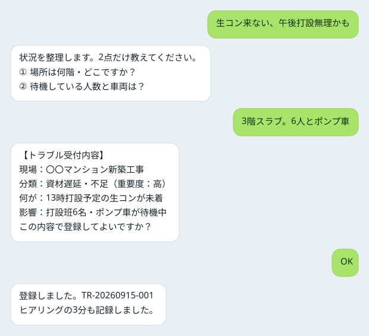
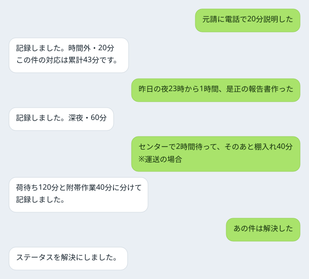
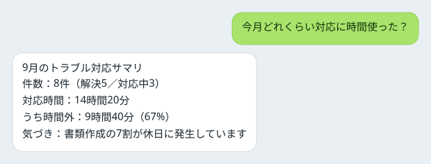

# 建設業界トラブル対応AIエージェント

**トラブル対応の「見えない残業」を、AIが肩代わりして見える化する。**

建設・製造・運送の現場で、トラブルが起きると夜や休日に電話・LINE・報告書づくりに追われる——。

このエージェントは、スマホで打った**一言の報告**から、足りない情報を短く聞き返し、
**報告文・取引先への依頼文・対応案**をすぐ作ります。

<p align="center">
  
</p>

## 目次

- [こんなときに使う](#こんなときに使う)
- [対応できるトラブル](#対応できるトラブル)
- [使い方](#使い方)
- [開発・カスタマイズ](#開発カスタマイズ)

## こんなときに使う

### 建設業 ― 「生コン来ない、午後打設無理かも」

<p align="center">
  
</p>

打設班6名とポンプ車が待機中。

元請の工事主任への報告、生コンプラント・ポンプ業者への連絡、今日の段取り替えを、職長が現場で一人で抱えている。

→ AIが以下をレポート
- **元請への状況報告**
- **プラント・ポンプ業者への連絡文（LINE用／メール用）**
- **今日中にやること**

### 中小製造業サプライヤー ― 「来週の数量が倍、土曜も出てくれって」

<p align="center">
  
</p>

内示2,000個が確定4,000個に。

断れば取引に響く、受ければ土曜出勤と材料の特急手配。これまでは「なんとかします」と返してきた。

→ AIが以下をレポート
- 発注元への返信
  - 対応可否
  - 条件（数量・納期）
  - 休日稼働の費用の相談
- 材料の追加手配の依頼文

## 対応できるトラブル

### 建設業

<p align="center">
  
</p>

### 中小製造業サプライヤー

<p align="center">
  
</p>

### 物流（トラック運送）

<p align="center">
  
</p>

## 使い方

<p align="center">
  
</p>

### 0. 準備（最初の1回だけ）

1. [Claude Code](https://claude.com/claude-code) と Python 3.11 以上を用意します（追加パッケージは不要です）。
2. このフォルダで Claude Code を起動します。

   ```bash
   cd kensetsu-trouble-agent && claude
   ```

3. （任意）業種を固定します。

   ```bash
   export TROUBLELOG_INDUSTRY=construction   # manufacturing / logistics
   ```

4. （任意・おすすめ）取引先リストを取り込みます。応援・代替手配の候補です。。列の形式は [取引先データのCSVインポート](CONTRIBUTING.md#取引先データのcsvインポート) を参照してください。まず試すならダミーデータをどうぞ。

   ```bash
   python3 -m troublelog partner import --industry construction --csv examples/construction/partners_sample.csv
   ```

### 1. 一言で報告する

思いついたままで構いません。

<p align="center">
  
</p>

### 2. 文面を受け取る

登録が終わると「報告文・連絡文・対応案を作りますか？」と聞かれます。「作って」と答えると、3種類がまとめて出てきます。

| | 建設 | 製造 | 運送 |
|---|---|---|---|
| ① 上位への報告 | 元請への状況報告 | 発注元への報告 | 荷主・元請運送会社への報告 |
| ② 取引先への依頼 | 協力会社・メーカーへの連絡（LINE用／メール用） | 仕入先・外注先への依頼 | 協力運送会社への依頼 |
| ③ 対応案 | いますぐ／今日中／明日以降／確認しておくこと／記録しておくこと | 同左 | 同左 |

- 「もっと柔らかく」「費用の話は外して」のように言えば直してくれます。
- ログにない数字（台数・金額など）は勝手に作らず `【要確認：〇〇】` として残ります。送る前に埋めてください。
- 文面には、待機・追加作業の時間を記録しておき、後で相談する旨の一文が入ります（後の協議の根拠になります）。

### 3. 対応したら一言で記録する

送った・電話した・書類を作った、を普段の言葉で伝えるだけです。

<p align="center">
  
</p>

### 4. 月末に集計する

<p align="center">
  
</p>

件数、分類別の件数と時間、対応時間の合計と**時間外・深夜・休日の内訳**を表で返し、事実にもとづく気づきを最大2つ添えます。

（例：「書類作成の7割が休日に発生しています」）。

### このフォルダ以外でも使いたい場合

Skill は `.claude/skills/` に置いてあり、**このフォルダで Claude Code を開いたときだけ**自動で読み込まれます。

別の現場フォルダや、どこからでも呼びたいときは、次のどちらかを行ってください。

**A. 個人スキルとして登録する（Claude Code のどのフォルダでも使えます）**

```bash
mkdir -p ~/.claude/skills
ln -s "$PWD/.claude/skills/trouble-intake" ~/.claude/skills/
ln -s "$PWD/.claude/skills/trouble-draft"  ~/.claude/skills/
ln -s "$PWD/.claude/skills/trouble-log"    ~/.claude/skills/
pip install -e .   # troublelog コマンドをどこからでも使えるようにします
```

シンボリックリンクなので、このリポジトリを更新すれば個人スキル側にも反映されます。

`pip install -e .` まで行うと、別フォルダからでもログの保存・集計まで動きます（保存先はこのリポジトリの `data/troubles.db` です）。

**B. Claude.ai（ブラウザ・スマホアプリ）にアップロードする**

```bash
./scripts/package_skills.sh
```

できた `dist/*.zip` を Claude.ai の設定からスキルとしてアップロードします。スマホから使えますが、CLI が動かないためログの保存・集計はできません（登録内容がJSONで表示されるだけです）。
